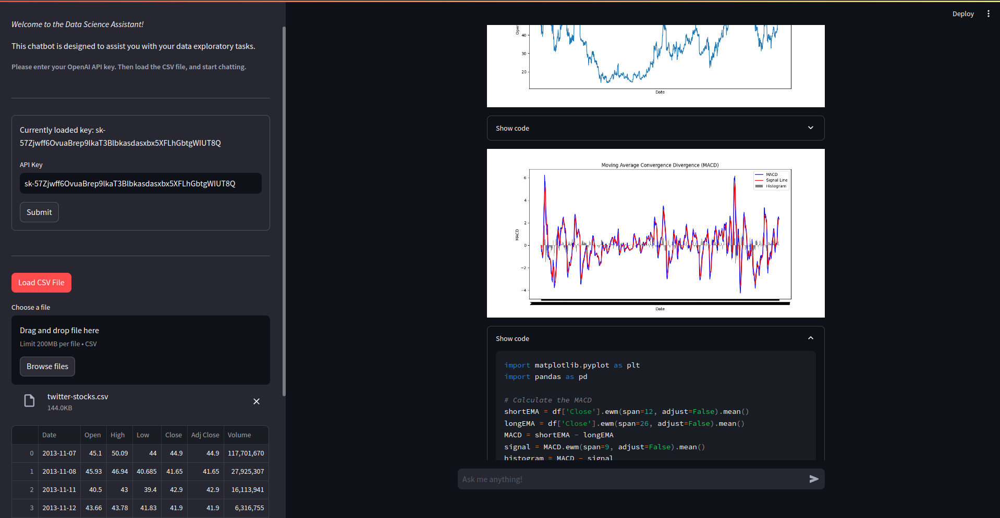
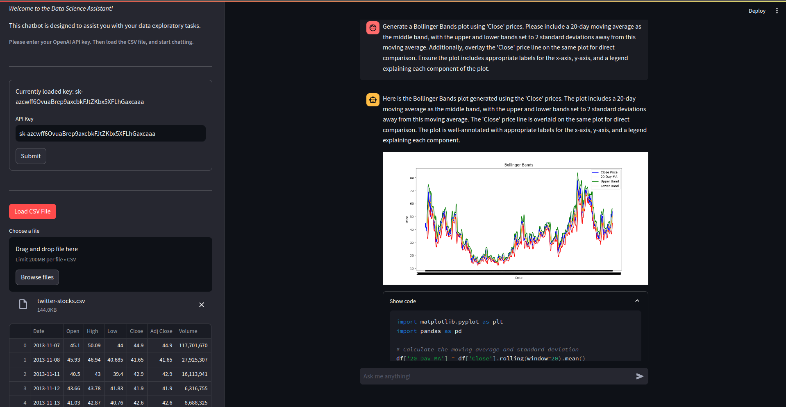

# Data assistant
This repository hosts an application designed for data exploration through conversations with a language model-based agent.

The assistant has the ability to make complex calculations and creating visual graphs. These elements are displayed interactively, accompanied by the code produced by the agent for full transparency and educational value.

The application is equipped with a code plot tool, which archives the generated images and renders them post-action and a customizable depth of chat history for message to message interaction.

Built on top of Streamlit and Langchain, the application utilizes Pandas and Matplotlib as key utilities for data manipulation and visualization.

Featured below are sample images from various chat sessions.

 
 

